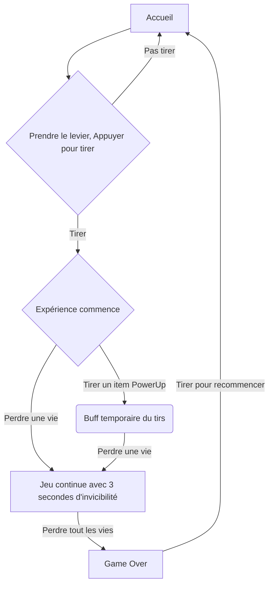
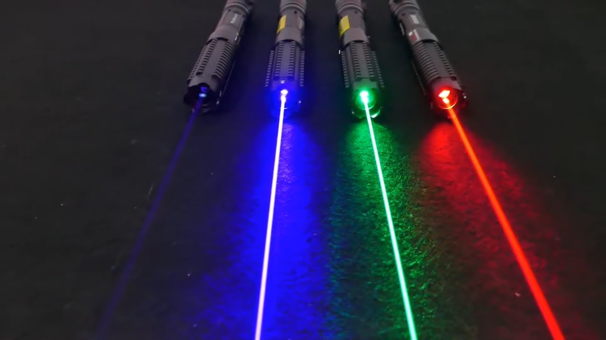
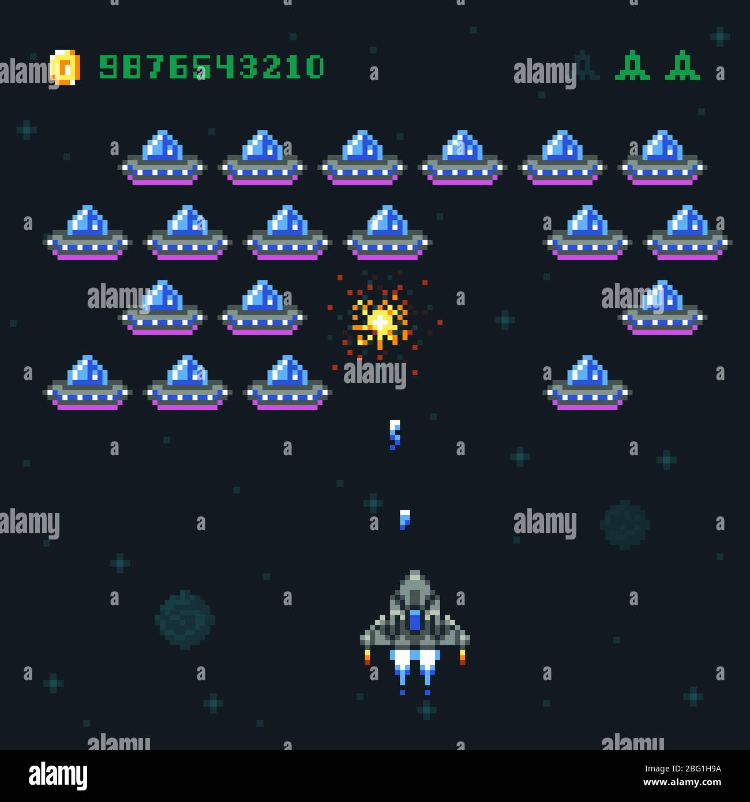
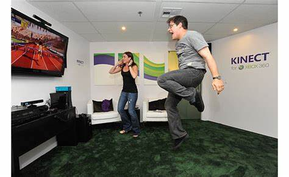
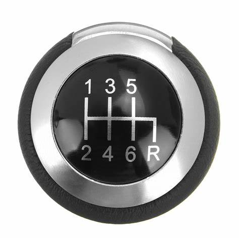

### Projet Odysée Mécanique
## Idée
# Concept
Recréé un atmosphère des années 1978 avec le jeu d'arcade réinventer de Space Invaders. Les joueurs seront poussé à faire competition pour battre le record du plus grand concurrent antécédant.
# Objectifs
Recréée le jeu connu d'arcade Spaceship. Un système de roue comme des patins à roulette ou de deplacement en général permettra un levier de se déplacer de gauche a droite permettrant au vaisseau mère de se déplacer et de tirer. Un laser s'animera à chaque tir et des PowerUps permettront d'aider le joueur à parvenir à atteindre un meilleur classement.

Je veux intégrer les connaissances apprises pendant la technique pour effectuer un jeu avec une capacité physique mobile pour que le testeur/joueur est une expérience de cette arcade bien plus réaliste et immersive avec les lasers et tout.

## Scénario

# Inspiration
## Moodboard visuel

## Moodboard Sonore
### Ambiance
Ambiance espace de style à suivre une musique très pensive comme https://www.youtube.com/watch?v=LlN8MPS7KQs où https://www.youtube.com/watch?v=c56t7upa8Bk. Je veux une ambiance qui laisse pensée que le monde est infini où espoir. J'optes bien plus pour snowfall.

Je veux une ambiance sombre pour laisser les éclairage gérer l'expérience. Les couleurs bien plus sombre.
* rouge vin [Laser ou lumière simulant laser]
* vert Orchidée [Tirs fusils, Powerups]

# Technologie utilisé
* Arduino [Détection de l'emplacement du levier]
* Unity &/où VsCode [Interface du jeu projeté]
* AfterEffect [Animation SpriteSheet]
* Lumière AmericanDJ [Ambiance lumineuse]
# Matériel
9 lasers activable à distance, 9 time of flight m5 stack, un meuble, un levier, 1 Mechanical Key Button Unit M5stack, une affiche du jeu que l'on peut coller sur le meuble, ordinateur, fils électriques (tout en général), système de rail, feutres de protections

###### *Documentation par Isaac Fafard