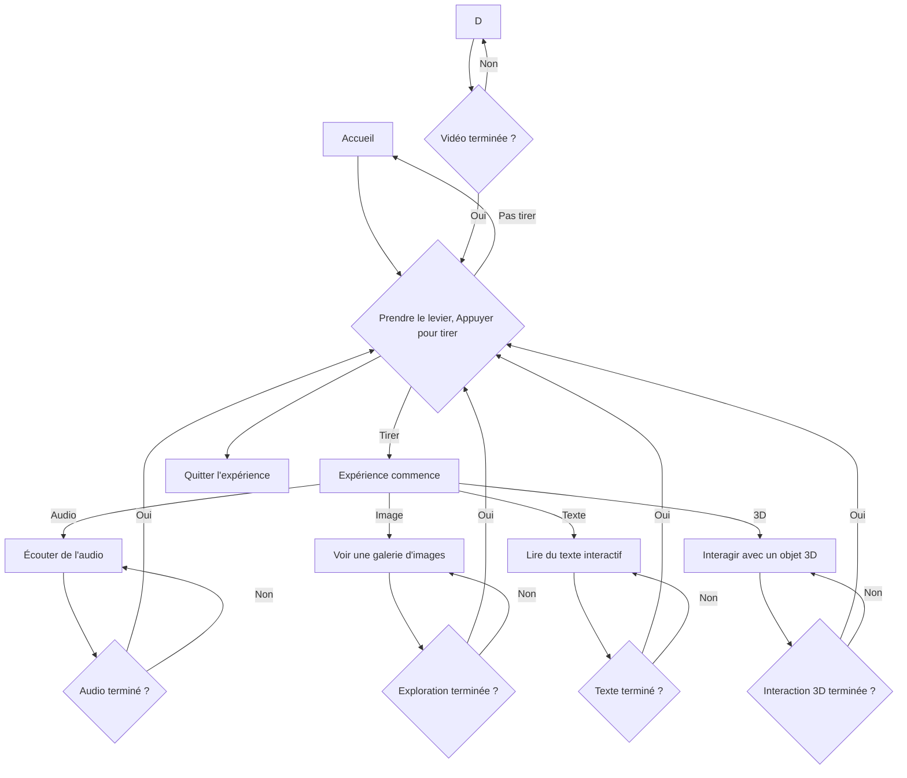

# projet Mermaid
Projet ou que l'on deplace un levier de gauche a droite avec un bouton au top. Le projet incarne le jeu populaire d'arcade rétro Spaceship

```mermaid
graph TD;
    A[Accueil] --> B{Prendre le levier, Appuyer pour tirer};
    B -->|Tirer| C[Expérience commence];
    

    B -->|Pas tirer| A;
    C -->|Audio| E[Écouter de l'audio];
    C -->|Image| F[Voir une galerie d'images];
    C -->|Texte| G[Lire du texte interactif];
    C -->|3D| H[Interagir avec un objet 3D];

    D --> I{Vidéo terminée ?};
    I -->|Oui| B;
    I -->|Non| D;

    E --> J{Audio terminé ?};
    J -->|Oui| B;
    J -->|Non| E;

    F --> K{Exploration terminée ?};
    K -->|Oui| B;
    K -->|Non| F;

    G --> L{Texte terminé ?};
    L -->|Oui| B;
    L -->|Non| G;

    H --> M{Interaction 3D terminée ?};
    M -->|Oui| B;
    M -->|Non| H;

    B --> N[Quitter l'expérience];
```